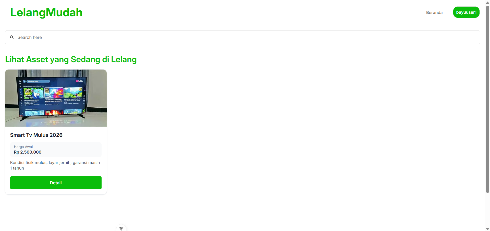
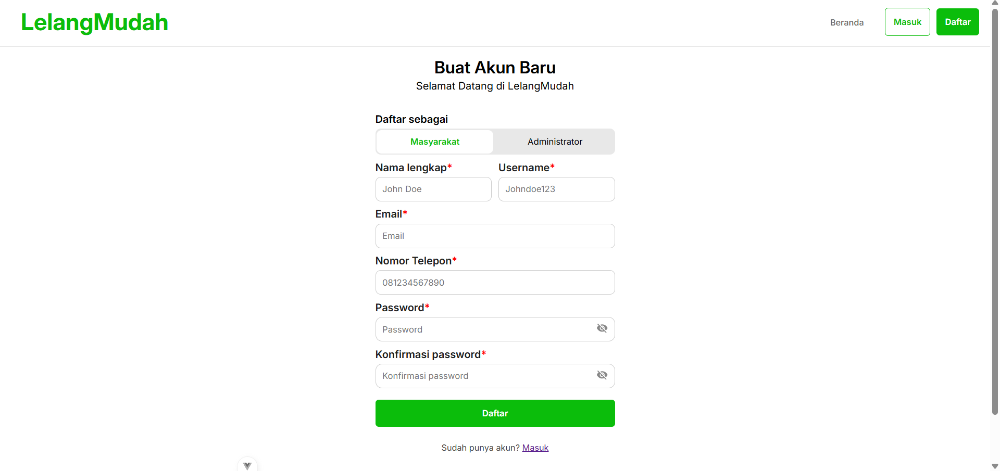
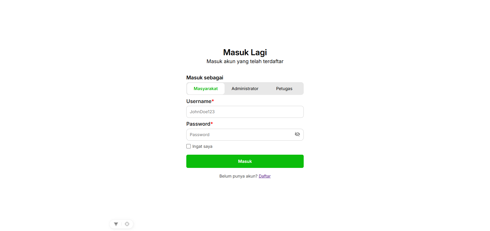
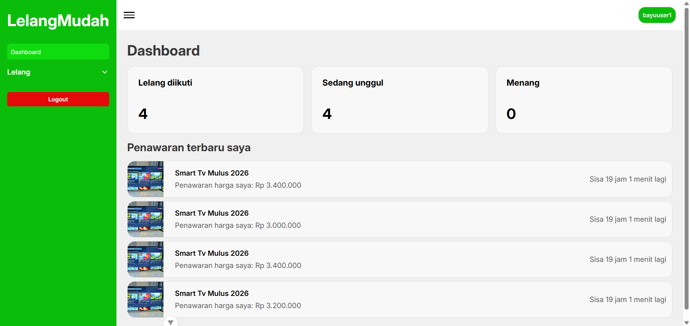
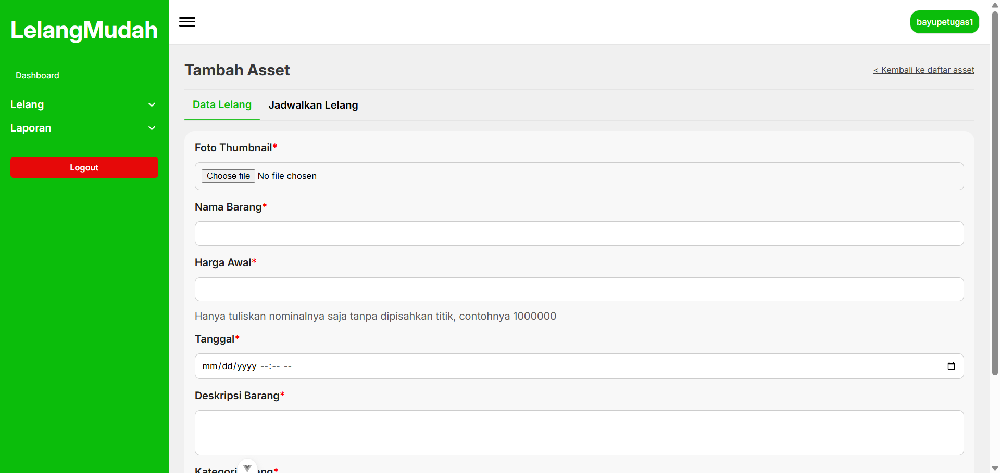
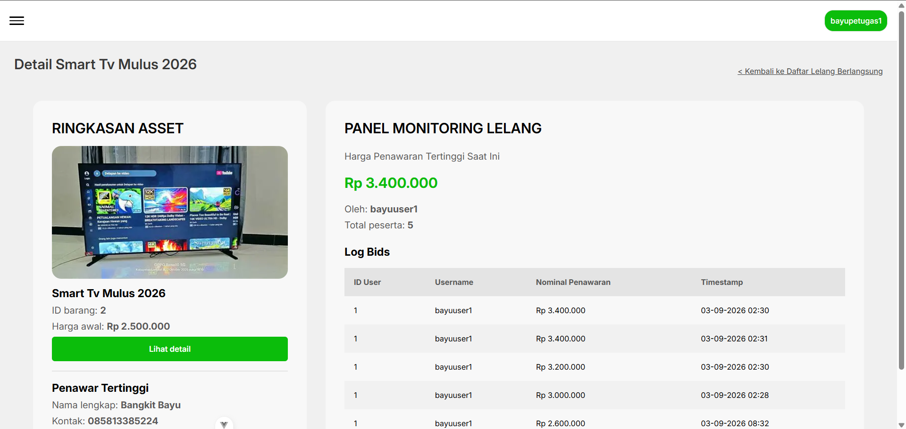
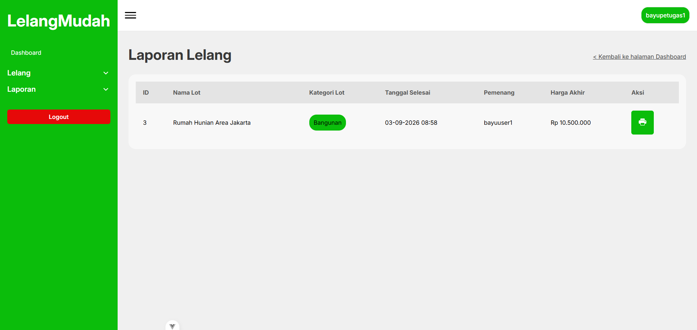

# LelangMudah - Sistem Lelang Online



> Website sistem lelang online yang memudahkan proses penawaran, pendataan, pemantauan, hingga laporan

---

## Deskripsi Project

LelangMudah adalah Sistem lelang online berbasis website yang dikembangkan untuk menyediakan platform online yang mudah digunakan
dan automasi untuk mempercepat flow operasional lelang. Sistem ini merupakan MVP (Minimum Viable Product).

**Latar Belakang**

**Tujuan**

- Mempercepat proses lelang
- Memudahkan pendataan barang lelang hingga barang tersebut dilelang
- Mempercepat proses laporan dan pengumuman otomatis

---

## Fitur Utama

- Register dan Login untuk masyarakat,administrator dan petugas
- Dashboard untuk masyarakat,administrator dan petugas
- CRUD barang lelang untuk petugas (tambah, edit, lihat dan hapus)
- Penjadwalan lelang
- Laporan lelang otomatis untuk admin dan petugas
- Pengumuman pemenang lelang online otomatis via email
- Kelola petugas untuk admin

**Batasan Fitur**
- Belum terintegrasi Payment Gateway

---

## Teknologi yang Digunakan

| Kategori         | Teknologi                      |
| ---------------- | ------------------------------ |
| Frontend         | Vue js 4, CSS                  |
| Backend          | Laravel 13                     |
| Database         | Mysql                          |
| Tools            | VSCode, Git & Github, Xampp    |
| Library Tambahan | Laravel DOMPdf (cetak laporan) |

## Arsitektur Sistem

Project ini menggunakan pola arsitektur **MVC (Model-View-Controller)** sederhana:

```
[ User Browser ]
        |
        v
[ View (Vue js, CSS) ]
        |
        v
[ Controller (Laravel) ] <--> [ Model (Query Database) ]
        |
        v
[ Database MySQL ]
```

## Instalasi & Setup

Ikuti langkah-langkah berikut untuk menjalankan project ini di komputer lokal:

```bash
# 1. Clone repository
git clone https://github.com/BangkitBayu/online-auction-system-school-project.git

# 2. Masuk ke folder project
cd online-auction-system-school-project

# 3. Masuk ke folder frontend
# buka terminal untuk mengunduh package yang diperlukan dengan perintah dibawah:
npm install
# setelah proses instalasi selesai jalankan proyek, dengan perintah dibawah:
npm run dev

# 4. Masuk ke folder backend
cd backend
# Lakukan migrate dan seed database terlebih dahulu
php artisan migrate --seed
# Jalankan proyek
php artisan serve
# Jalankan scheduler
php artisan schedule:work

# 5. Jalankan web server XAMPP
# Jalankan apache dan mysql
```

**Requirements:**

- PHP >= 8.2
- NODEJS >= 22 / 24 / yang lain direkomendasikan yang LTS
- Web Server (Apache/XAMPP/Laragon)

---

## Screenshot
<!-- > *(Ganti dengan screenshot asli aplikasi kamu)* -->
| Halaman   | Screenshot |
|-----------|------------|
| Register  |  |
| Login     |  |
| Home      |  |
| Dashboard |  |
| Pendataan lelang |  |
| Monitoring lelang |  |
| Laporan lelang |  |
---

## Lisensi
 
Project ini dibuat untuk keperluan tugas sekolah dan dilisensikan di bawah [MIT License](https://opensource.org/licenses/MIT) — bebas digunakan untuk pembelajaran.
 
---